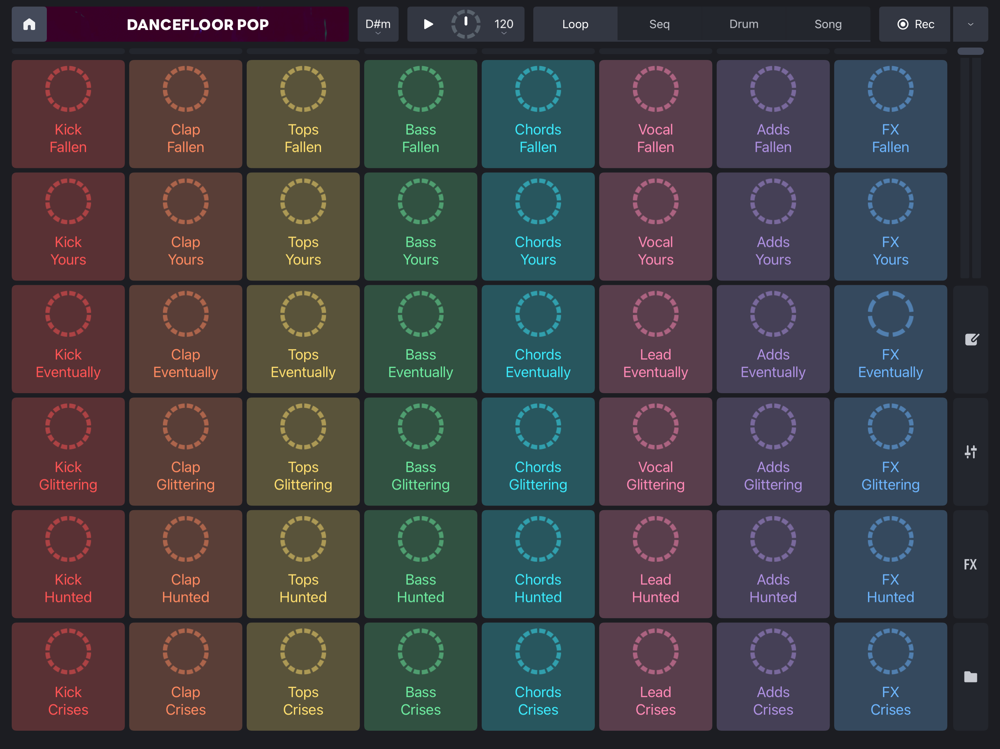

# rzha0840_group-G_audio

## User Interaction Instructions
After the page finishes loading, users will see a visual composition generated by our group’s code, featuring 17 BasicCircles. When a user clicks on a BasicCircle, the audio track linked to that circle will begin to play. At the same time, the circle’s decorative elements (DotRing, SpokeRing, and InnerDotRing) will rotate clockwise to support the system’s visual feedback. Clicking the same circle again will stop both the rotation and the music. Users can click multiple circles to layer different sounds, gradually building a unique remix. This interaction symbolizes the encounters and interweaving of lives.

---

## Details of my individual approach to animating the group code  
**I chose *Audio* as the method to drive my individual code.**

---

**2.1 The properties that are animated and how they are animated**
  - My design focuses on audio interaction at the BasicCircle level, where each BasicCircle and its associated ring components are modularized to support both independent animation and interactive linkage. Within the main BasicCircle class, rotation angle changes are driven by state control (such as the PLAYING state), enabling synchronized rotation of all linked subcomponents—like dot rings, spoke rings, and concentric rings—ensuring consistent and coordinated animation and interaction.
  - To ensure music enters in a unified rhythm, I selected audio tracks with a BPM of 120 and use a global variable masterBPM to calculate the rotation speed, so that one full rotation corresponds to a fixed number of beats (for example, one full turn every 4 beats). This achieves synchronization between the animation and the musical beat, creating a cohesive dynamic visual effect.
  - Additionally, the interaction design uses click events and a state machine (INACTIVE, PENDING, PLAYING) to control audio playback start and stop, ensuring new tracks can be introduced orderly on rhythm nodes without off-beat errors. Visual cues such as a gray overlay and rotation effects intuitively communicate different states, enhancing user awareness of the system status.

---

**2.2 Imaging Technique Inspiration**
- My visual inspiration did not come directly from a specific image, but rather emerged from a broader reflection on generative art and audio interaction. The main sources of inspiration for this work include:
  - Music visualization tools and DJ software such as Remixlive, where each button represents a loop track, allowing users to freely create music they enjoy.

  - The music game Incredibox, which enables users to compose music through intuitive drag-and-drop interactions.
  
- Both allow users to create music they enjoy through interaction, and use special visual effects to indicate different music states — such as when a sound is off-beat or not yet activated.

- In terms of code, I was inspired by Patt Vira’s creations, especially [Musical Onion](https://editor.p5js.org/pattvira/sketches/i4148aPkc) and [Rotating Polygons on the Major Scale](https://editor.p5js.org/pattvira/sketches/Pa1_cdABS). 
- These works encouraged me to enhance visual effects that respond to audio, while also helping users better understand the system's state.

---

**2.3 Coding Technique Exploration**
- I did not make extensive modifications to the group code, only the previously mentioned grouping by BasicCircle units.

- In the BasicCircle class, we implemented beat-synchronized music interaction using the audioContext.currentTime method. Each circle has its own playback state: INACTIVE, PENDING, and PLAYING. When the mouse is clicked:
  - If no other track is playing, the circle immediately starts playing its associated audio.
  - If a track is already playing, the clicked circle enters the PENDING state. It continuously checks whether it can begin playback on the next beat by aligning the time using audioContext.currentTime % beatLength.
- To achieve this, with the help of ChatGPT, I implemented a helper function checkPendingTracks() which runs every frame. Pending tracks only start playing when the global time aligns with the beat, ensuring all tracks remain rhythmically synchronized.

- Additionally, the BasicCircle class exposes a rotationAngle value that is passed to visual components such as RingFill, DotRing, and SpokeRing. These components rotate synchronously according to this angle, providing clear visual feedback of the current music playback state. For example, in RingFill, each concentric ring slightly rotates every frame based on rotationAngle, visually representing the dynamic spinning of sound.

Notes:
- Here are some design attempts I hoped to implement but ultimately failed:
  - I wanted to add indicator text, but introducing a global variable textHeight and enlarging the canvas caused the group code’s canvas boundaries to become disordered. After multiple attempts, I couldn’t achieve this without affecting the original code’s effects, so I abandoned it.
  - I also wanted to fix the glowing effect of ChainLink while maintaining its random color feature. However, the AI-suggested code fixed ChainLink colors and didn’t properly handle the no-loop relationship, so I gave up on this as well.

---

**2.4 External Resources**
- The technical principles are based on suggestions from AI tools such as ChatGPT and Gemini. For example, in this project, following ChatGPT's advice, I used audioContext.currentTime to track music playback time to ensure rhythm-aligned playback.
- The project only uses p5.js and the Web Audio API, with no other external libraries.
- All music assets are sourced from the free audio platform [BandLab](https://www.bandlab.com/)